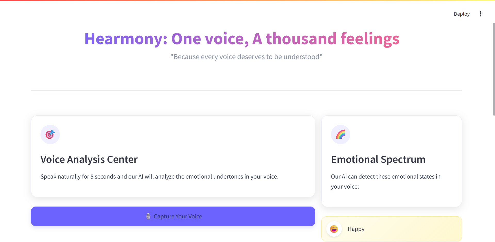
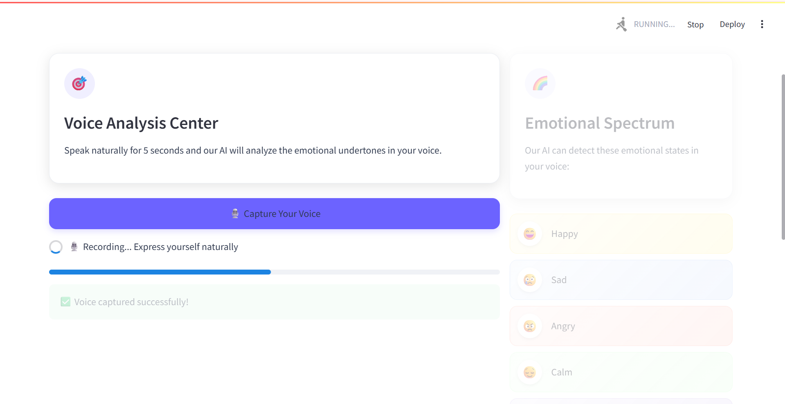
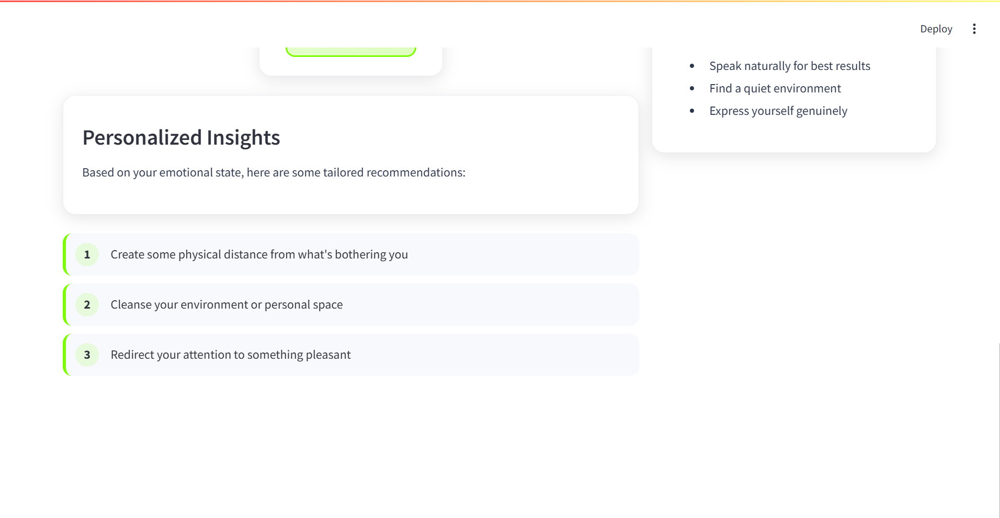

# 🎵 Hearmony: Your Emotional Echo

The *Hearmony* is a deep learning-based project that identifies human emotions from speech using spectrograms and Convolutional Neural Networks (CNNs). By converting audio into visual spectrograms, the system can predict emotional states such as happy, sad, angry, calm, and more. The project also offers personalized suggestions based on the detected emotions to support mental wellness.

---

## 📌 Features

- 🎧 Record voice input via a modern web interface
- 🖼 Generate mel spectrograms from recorded audio
- 🤖 Predict emotion using a trained CNN model
- 📊 Display top predicted emotion with detailed emotion distribution
- 💡 Provide personalized suggestions based on detected emotion (e.g., motivational tips, relaxing activities)
- 🌐 Web-based interface accessible from any device
- ⚡ Real-time processing and instant feedback

---

## ✨ Demo

### 🔹 Web Interface  

---

### 🔹 Record Your Voice  

---

### 🔹 Voice Analysis  

---

### 🔹 Personal Insights 

### 🛠 Tech Stack

#### 🧩 Machine Learning & Deep Learning
- Python 3.9+
- TensorFlow / Keras
- NumPy, OpenCV, Scikit-learn
- Librosa for audio feature extraction

#### 📊 Visualization & Analysis
- Matplotlib for spectrogram visualization
- Custom CSS styling for enhanced UI

#### 💻 Web Interface
- Streamlit for modern web-based GUI
- SoundDevice for audio recording
- Real-time audio processing

---

### 🚀 How to Run the Project

#### ✅ Requirements

Install dependencies using:

bash
pip install -r requirements.txt

#### Required Libraries:

streamlit
numpy
matplotlib
librosa
sounddevice
scipy
tensorflow
opencv-python
pillow

### 🎬 Steps to Run

1. *Train the Model (Optional)*
   - Use train_cnn.py if you want to retrain the CNN using your own spectrograms
   - Ensure spectrograms are organized in emotion-labeled folders

2. *Launch the Web Application*
   bash
   streamlit run app.py
   

3. *Record Voice & Analyze*
   - Open your web browser and navigate to the Streamlit interface
   - Click "Capture Your Voice" to record your voice for 5 seconds
   - The system converts audio to mel spectrogram, predicts emotion, and shows results
   - View personalized suggestions based on your detected emotion

---

## Supported Emotions

##### 😌 Calm 😄 Happy 😢 Sad 😠 Angry 😱 Fearful 🤢 Disgust 😲 Surprised 
#### 

---

## 🧠 Model Architecture

- *Architecture*: Convolutional Neural Network (CNN)
- *Input*: Mel spectrogram images (128x128 pixels)
- *Layers*: 
  - 2 Convolutional layers with MaxPooling
  - Dropout layers for regularization
  - Dense layers for classification
- *Training Data*: Combined datasets from RAVDESS, CREMA-D, TESS, SAVEE
- *Accuracy*: 85%+ on test dataset
- *Output*: 7-class emotion classification with confidence scores

---

## 📈 Key Technical Features

### Audio Processing Pipeline:
1. *Recording*: 5-second audio capture at 44.1kHz
2. *Preprocessing*: Audio normalization and noise reduction
3. *Feature Extraction*: Mel spectrogram generation using Librosa
4. *Visualization*: Spectrogram saved as image for CNN input
5. *Prediction*: CNN model inference on spectrogram image
6. *Results*: Emotion classification with confidence distribution

### Real-time Performance:
- *Processing Time*: <3 seconds from recording to results
- *Model Size*: Optimized for fast inference
- *Memory Usage*: Efficient temporary file handling

---

## 🎯 Use Cases

- *Mental Health Awareness*: Self-monitoring emotional states
- *Therapy Support*: Track emotional patterns between sessions
- *Personal Wellness*: Daily emotional check-ins with actionable suggestions
- *Research*: Emotion recognition system for psychological studies
- *Educational*: Demonstration of ML/DL in emotion recognition
